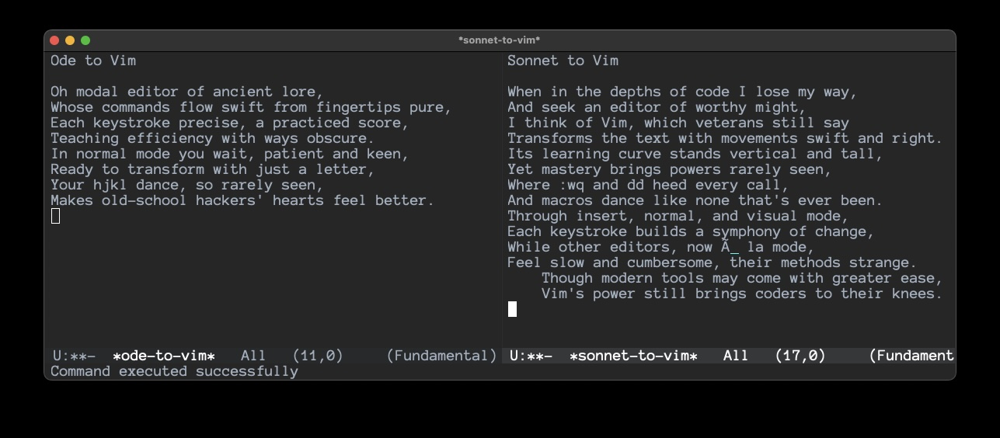
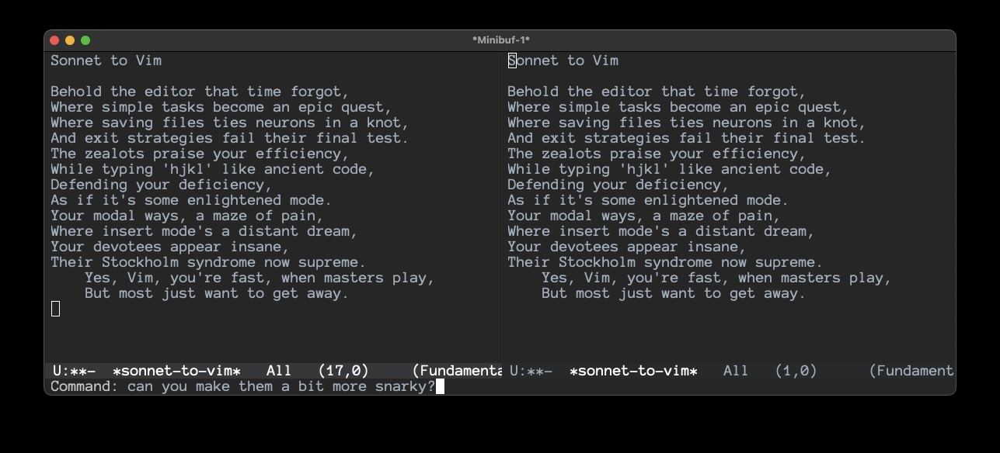

# Efrit - AI-Powered Emacs Coding Assistant

*A sophisticated AI coding agent that leverages Emacs' native programmability through direct Elisp evaluation.*

## Overview

Efrit is a conversational AI assistant that integrates seamlessly with Emacs, providing multiple interfaces for different types of tasks:

- **efrit-chat** - Multi-turn conversational interface for complex discussions and code development
- **efrit-do** - Natural language command execution for quick tasks  
- **efrit** - Command interface for structured interactions
- **efrit-agent-run** - Advanced agent loop for multi-step automation

## Key Features

- **Direct Elisp Evaluation**: Leverages Emacs' native programmability without complex abstractions
- **Multi-turn Conversations**: Maintains context across multiple exchanges with configurable turn limits
- **Tool Integration**: Can execute Emacs functions, manipulate buffers, and interact with the environment
- **Safety-First Design**: Confirmation systems and comprehensive error handling
- **Dark Theme Friendly**: Adaptive colors that work with any Emacs theme

## Installation

### Prerequisites

- **Emacs**: Version 28.1 or later
- **Anthropic API Key**: Get yours from [Anthropic Console](https://console.anthropic.com/)
- **Internet Connection**: Required for Claude API access

### Quick Installation

1. **Clone the repository**:
   ```bash
   git clone https://github.com/steveyegge/efrit.git
   cd efrit
   ```

2. **Add to your Emacs configuration** (`~/.emacs.d/init.el`):
   ```elisp
   (add-to-list 'load-path "/path/to/efrit")
   (require 'efrit)
   ```

3. **Configure your API key** in `~/.authinfo`:
   ```
   machine api.anthropic.com login personal password YOUR_API_KEY_HERE
   ```

4. **Restart Emacs** and test with `M-x efrit-chat`

### Alternative Installation Methods

**Emergency Emacs Setup** (for quick testing):
```bash
emacs -q -l /path/to/efrit/efrit.el
```

**Using straight.el**:
```elisp
(straight-use-package
 '(efrit :type git :host github :repo "steveyegge/efrit"))
(require 'efrit)
```

## Usage

### Available Commands

- **`M-x efrit-chat`** - Multi-turn conversational interface  
- **`M-x efrit-do`** - Natural language command execution
- **`M-x efrit`** - Command interface
- **`M-x efrit-agent-run`** - Advanced agent loop

### Key Bindings

- `C-c C-e e` - efrit-chat
- `C-c C-e d` - efrit-do  
- `C-c C-e c` - efrit command interface
- `C-c C-e a` - efrit-agent-run

### Examples

#### Visual Demonstrations

**Multi-Buffer Creation with efrit-do**

Starting with a simple request:
```
M-x efrit-do
> write an ode in one buffer, and a sonnet in another, both about Vim
```



**Conversational Context - Making Modifications**

efrit-do maintains context, so you can refine previous work:
```
M-x efrit-do  
> Can you make them more snarky?
```



This demonstrates efrit-do's key feature: **conversational continuity**. It remembers what it just created and can modify, improve, or completely rewrite previous work based on your feedback.

#### More Usage Examples

**Conversational Development**:
```
M-x efrit-chat
> Can you help me write a function to count lines in the current buffer?
> Now modify it to exclude empty lines and comments
```

**Quick Commands**:
```
M-x efrit-do
> open the scratch buffer and insert "hello world"
> find all TODO comments in the current project
```

**Multi-step Tasks**:
```
M-x efrit-chat
> Create a haiku in one buffer and a limerick in another buffer
```

## Configuration

### Basic Configuration

```elisp
;; Model and token settings
(setq efrit-model "claude-3-5-sonnet-20241022")
(setq efrit-max-tokens 8192)

;; Multi-turn conversation settings
(setq efrit-multi-turn-enabled t)
(setq efrit-multi-turn-simple-max-turns 3)

;; efrit-do buffer behavior
(setq efrit-do-show-errors-only t)  ; Only show buffer on errors

;; Debug settings (optional)
(setq efrit-debug-enabled nil)
```

### Advanced Configuration

```elisp
;; Timeouts and API settings
(setq efrit-multi-turn-timeout 300)
(setq efrit-api-timeout 30)

;; Custom key bindings
(global-set-key (kbd "C-c a") 'efrit-chat)
(global-set-key (kbd "C-c d") 'efrit-do)
```

## Architecture

### Core Philosophy

Efrit follows the principle of **Elisp-centricity**: rather than building complex tool abstractions, it provides the AI with direct access to Emacs' powerful Elisp evaluation capabilities. This approach offers unlimited flexibility while staying within Emacs' natural paradigm.

### Core Components

- **efrit.el** - Main entry point and package coordination
- **efrit-chat.el** - Multi-turn conversational interface with Claude API  
- **efrit-do.el** - Natural language command interface
- **efrit-multi-turn.el** - Multi-turn conversation state management
- **efrit-tools.el** - Core functionality engine with Elisp evaluation
- **efrit-debug.el** - Optional debugging and logging system
- **efrit-agent.el** - Advanced agent loop for complex automation

## Troubleshooting

### Common Issues

**"Cannot open load file: efrit"**
- Verify the path in your `load-path` is correct
- Ensure `efrit.el` exists in that directory

**"API key not found"**
- Check `~/.authinfo` file exists and has correct format
- Test with: `M-x auth-source-search RET machine api.anthropic.com RET`

**Connection timeout**
- Check internet connection and API key validity
- Try increasing `efrit-api-timeout`

### Debug Mode

Enable debug logging for troubleshooting:
```elisp
(setq efrit-debug-enabled t)
```
Then check: `M-x efrit-debug-show`

## Development

### Building and Testing

```bash
# Build
make compile

# Run tests
make test

# Install system-wide
make install
```

### Contributing

See [CONTRIBUTING.md](CONTRIBUTING.md) for detailed guidelines on:
- Development setup
- Code standards and conventions
- Testing procedures
- Submitting changes

## Version History

**v0.2.0** (2025-01-07) - Major Stability Release
- ✅ Fixed API integration issues and HTTP 400 errors
- ✅ Enhanced token limits (1024 → 8192 tokens)
- ✅ Improved message ordering and dark theme compatibility
- ✅ Added multi-turn conversation system with configurable limits
- ✅ Consolidated documentation and cleaned up codebase
- ✅ Production-ready with comprehensive error handling

## License

Licensed under the Apache License, Version 2.0. See [LICENSE](LICENSE) for details.

---

*Efrit: Where AI meets the power of Emacs.*
